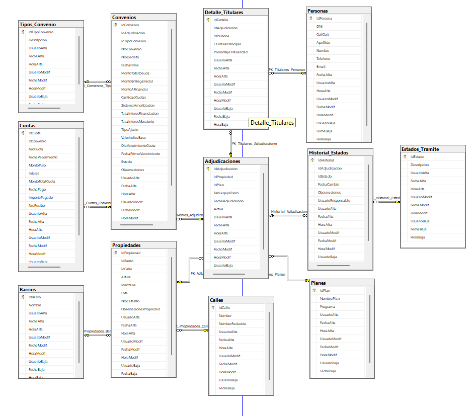

Housing Finance & Administrative Engine (IMV Architecture) 🏗️📈
Descripción del Proyecto
Este repositorio documenta la arquitectura de datos y la lógica de negocio para un sistema integral de administración habitacional. El proyecto nace de la necesidad de migrar y normalizar una base de datos histórica de 5.400 registros hacia una solución relacional robusta en SQL Server.

El sistema ha evolucionado de ser un simple registro a una herramienta de administración integral que abarca desde la gestión de beneficiarios hasta la trazabilidad financiera compleja.

🚀 Desafíos Técnicos y Soluciones
1. Modelado Financiero Multivariante
El núcleo del sistema es un motor de cálculo que procesa diferentes tipos de financiación y actualización de deuda, validado bajo normativas contables vigentes:

Índices de Actualización: Implementación de lógicas para el cálculo basado en Casa Propia y UVIS.

Gestión de Mora: Motor de cálculo de intereses moratorios automáticos basados en la Ordenanza Tributaria municipal.

Validación Contable: Arquitectura diseñada en conjunto con el área contable para asegurar la integridad de los estados de deuda.

2. Normalización de Datos Críticos
Ejecución de un proceso de saneamiento sobre 5.400 registros heterogéneos.

Eliminación de redundancias y estandarización de formatos para asegurar la integridad referencial.

3. Administración Integral de Convenios
Trazabilidad completa de convenios de pago, refinanciaciones y estados de cuotas.

Diseño de una base de datos con integridad referencial estricta para evitar inconsistencias en saldos históricos.

### 📊 Arquitectura del Modelo de Datos
Diseño relacional orientado a la gestión integral de convenios, adjudicaciones y trazabilidad de pagos.

*Nota: El diagrama representa la estructura lógica de la base de datos anonimizada para proteger la integridad del sistema municipal.*

🛠️ Stack Tecnológico Proyectado
Database: SQL Server (Arquitectura Relacional).

Backend: .NET Core (Business Logic Layer).

Data Analysis: Looker Studio / Dashboards para visualización de métricas habitacionales.

Metodología: Gestión bajo lineamientos de Project Management y Scrum Fundamentals.

🔒 Confidencialidad y Ética Profesional
Debido a la naturaleza del proyecto y a las políticas de datos públicos del Instituto Municipal de la Vivienda (Rafaela), el código fuente y los datasets reales no están disponibles públicamente. Este repositorio sirve como documentación de la capacidad técnica, lógica de negocio y arquitectura de sistemas implementada.

👤 Autor
Leonel Nicolás Bürgi

.NET Developer | Data Analyst | Project Manager

Estudiante de Tec. Sup. en Desarrollo de Software 

Background en Ingeniería Civil y Gestión de Proyectos
